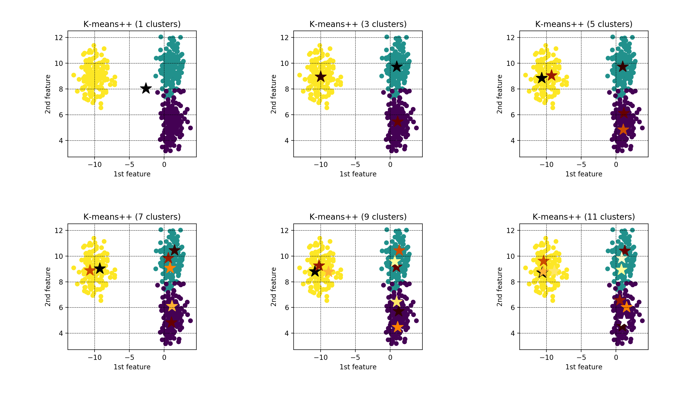
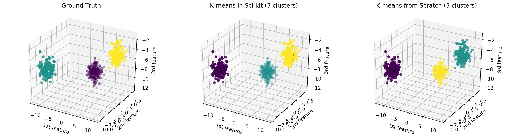
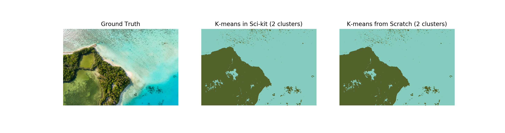
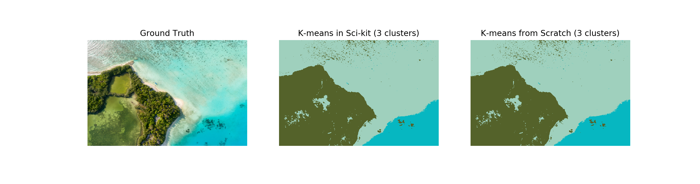
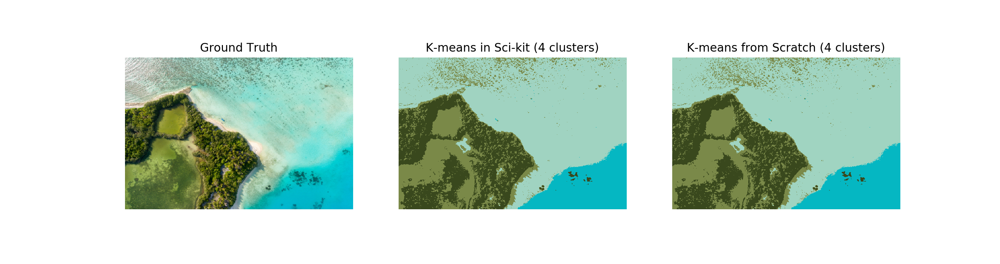

# k-means / k-means++

### Title

[k-menas clustering](https://en.wikipedia.org/wiki/K-means_clustering)

### Abstract

**k-means clustering** is a method of [vector quantization](https://en.wikipedia.org/wiki/Vector_quantization), originally from signal processing, that is popular for [cluster analysis](https://en.wikipedia.org/wiki/Cluster_analysis) in [data mining](https://en.wikipedia.org/wiki/Data_mining). k-means clustering aims to partition n observations into k clusters in which each observation belongs to the cluster with the nearest mean, serving as a prototype of the cluster. This results in a partitioning of the data space into Voronoi cells. k-Means minimizes within-cluster variances (squared Euclidean distances), but not regular Euclidean distances, which would be the more difficult Weber problem: the mean optimizes squared errors, whereas only the geometric median minimizes Euclidean distances. Better Euclidean solutions can for example be found using k-medians and k-medoids.

---

### Title

[k-menas++](https://en.wikipedia.org/wiki/K-means%2B%2B)

### Abstract

In [data mining](https://en.wikipedia.org/wiki/Data_mining), **k-means++** is **an algorithm for choosing the initial values (or "seeds") for the k-means clustering algorithm**. It was proposed in 2007 by David Arthur and Sergei Vassilvitskii, as an approximation algorithm for the NP-hard k-means problem—a way of avoiding the sometimes poor clusterings found by the standard k-means algorithm. It is similar to the first of three seeding methods proposed, in independent work, in 2006[3] by Rafail Ostrovsky, Yuval Rabani, Leonard Schulman and Chaitanya Swamy. (The distribution of the first seed is different.)

---

## References

[1] [k-means clustering, wikipidea](https://en.wikipedia.org/wiki/K-means_clustering)\
[2] [k-means++, wikipidea](https://en.wikipedia.org/wiki/K-means%2B%2B)\
[3] [K means clustering - Introduction, GeeksforGeeks](https://www.geeksforgeeks.org/k-means-clustering-introduction/)\
[4] [ML | K-means++ Algorithm, GeeksforGeeks](https://www.geeksforgeeks.org/ml-k-means-algorithm/)\
[5] [Implementing K-means Clustering from Scratch - in Python](https://mmuratarat.github.io/2019-07-23/kmeans_from_scratch)\
[6] [K-Means Clustering in Python](https://mubaris.com/posts/kmeans-clustering/)\
[7] [K-means Clustering Python Example](https://towardsdatascience.com/machine-learning-algorithms-part-9-k-means-example-in-python-f2ad05ed5203)\
[8] [Introduction to Image Segmentation with K-Means clustering](https://towardsdatascience.com/introduction-to-image-segmentation-with-k-means-clustering-83fd0a9e2fc3)

---

## Theory

K-means clustering algorithm is one of the simplest and popular unsupervised machine learning algorithm.
Because the k-means clustering algorithm is unsupervised machine learning algorithm, they do not need labeled data during the training phase.
Trained k-means clustering algorithm can classify (or clusters) given data into k-clusters. 
To determine the class, the k-means method calculates the distance between given data and a **centroid of each k-clusters**, 
and the closest k-cluster is determined by the class of the data.

How is the centroid of each clusters optimized? 
To optimize the centroid of each clusters, below objective function $L(c)$ is to minimize the sum of squared distances between all data and the centroid of clusters.

$$
L(x, c) =  \sum_{j=1}^{k} \sum_{i=1}^{n} {||x_{j}^{i} - c_{j} ||_2^2},
$$

where $x$ and $n$ denote data and the number of data, respectively, and $c$ and $k$ are centroid of each clusters and the number of clusters, respectively.

Technically, an initial point $c$ of the centroid for each clusters is chosen randomly. Since the dataset $x$ is not commonly convex, the centroid point $c$ does not converge to the global solution. To improve stability of the convergence, [k-means++ algorithm](https://en.wikipedia.org/wiki/K-means%2B%2B) was developed to choose initial point with good condition. 

$$
WCSS(x, c) = \sum_{i=1}^{n} {||x^{i} - c^{i}||_2^2},
$$

---
<!--

-->

## Results
 of elbow method")

