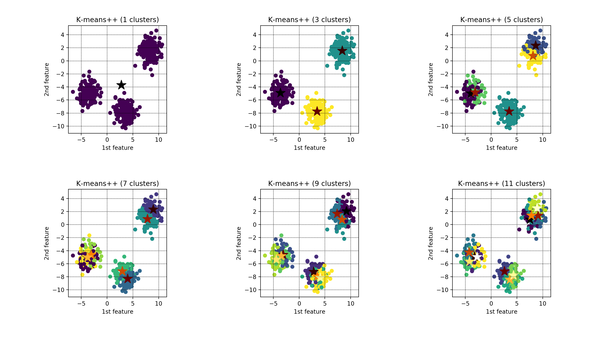

# k-means / k-means++

### Title

[k-means clustering](https://en.wikipedia.org/wiki/K-means_clustering)

### Abstract

**k-means clustering** is a method of [vector quantization](https://en.wikipedia.org/wiki/Vector_quantization), originally from signal processing, that is popular for [cluster analysis](https://en.wikipedia.org/wiki/Cluster_analysis) in [data mining](https://en.wikipedia.org/wiki/Data_mining). k-means clustering aims to partition n observations into k clusters in which each observation belongs to the cluster with the nearest mean, serving as a prototype of the cluster. This results in a partitioning of the data space into Voronoi cells. k-Means minimizes within-cluster variances (squared Euclidean distances), but not regular Euclidean distances, which would be the more difficult Weber problem: the mean optimizes squared errors, whereas only the geometric median minimizes Euclidean distances. Better Euclidean solutions can for example be found using k-medians and k-medoids.

---

### Title

[k-menas++](https://en.wikipedia.org/wiki/K-means%2B%2B)

### Abstract

In [data mining](https://en.wikipedia.org/wiki/Data_mining), **k-means++** is **an algorithm for choosing the initial values (or "seeds") for the k-means clustering algorithm**. It was proposed in 2007 by David Arthur and Sergei Vassilvitskii, as an approximation algorithm for the NP-hard k-means problem—a way of avoiding the sometimes poor clusterings found by the standard k-means algorithm. It is similar to the first of three seeding methods proposed, in independent work, in 2006[3] by Rafail Ostrovsky, Yuval Rabani, Leonard Schulman and Chaitanya Swamy. (The distribution of the first seed is different.)

---

## References

[1] [k-means clustering, wikipidea](https://en.wikipedia.org/wiki/K-means_clustering)\
[2] [k-means++, wikipidea](https://en.wikipedia.org/wiki/K-means%2B%2B)\
[3] [K means clustering - Introduction, GeeksforGeeks](https://www.geeksforgeeks.org/k-means-clustering-introduction/)\
[4] [ML | K-means++ Algorithm, GeeksforGeeks](https://www.geeksforgeeks.org/ml-k-means-algorithm/)\
[5] [Implementing K-means Clustering from Scratch - in Python](https://mmuratarat.github.io/2019-07-23/kmeans_from_scratch)\
[6] [K-Means Clustering in Python](https://mubaris.com/posts/kmeans-clustering/)\
[7] [K-means Clustering Python Example](https://towardsdatascience.com/machine-learning-algorithms-part-9-k-means-example-in-python-f2ad05ed5203)\
[8] [Introduction to Image Segmentation with K-Means clustering](https://towardsdatascience.com/introduction-to-image-segmentation-with-k-means-clustering-83fd0a9e2fc3)

---

## Theory

K-means clustering algorithm is one of the simplest and popular unsupervised machine learning algorithm.
Because the k-means clustering algorithm is unsupervised machine learning algorithm, they do not need labeled data during the training phase.
Trained k-means clustering algorithm can classify (or clusters) given data into k-clusters.
To determine the class, the k-means method calculates the distance between given data and a **centroid of each k-clusters**,
and the closest k-cluster is determined by the class of the data.

How is the centroid of each clusters optimized?
To optimize the centroid of each clusters, below objective function $L(c)$ is to minimize the sum of squared distances between all data and the centroid of clusters.

$$
L(x, c) =  \sum_{j=1}^{k} \sum_{i=1}^{n} {||x_{j}^{i} - c_{j} ||_2^2},
$$

where $x$ and $n$ denote data and the number of data, respectively, and $c$ and $k$ are centroid of each clusters and the number of clusters, respectively.

---

Technically, an initial point $c$ of the centroid for each clusters is chosen randomly. Since the dataset $x$ is commonly not convex, the centroid point $c$ does not converge to the global solution. To improve stability of the convergence, [k-means++ initialization algorithm](https://en.wikipedia.org/wiki/K-means%2B%2B) was developed to choose well-condition initial point.

The k-means++ initialization algorithm is as follows [[4]](https://www.geeksforgeeks.org/ml-k-means-algorithm/):

1. Randomly select the first centroid $c^{k}$ from the data points $x$.

2. For each data point $x$, compute its distance from the nearest, previously chosen centroid $c^{k}$.

3. Select the next centroid $c^{k+1}$ from the data points $x$ such that the probability of choosing a point $x$ as centroid is directly proportional to its distance from the nearest, previously chosen centroid $c^{k}$. (i.e. the point $x$ having maximum distance from the nearest centroid $c^{i}$ is most likely to be selected next as a centroid $c^{j}$)

4. Repeat steps 2 and 3 until k centroids have been sampled.

Fig. 1 shows the sequence for how to select the three initial centroid points. First centroid is chosen randomly (see Fig. 1(1,1)), and second centroid is point having maximum distance from the first centroid (see Fig. 1(1,2)). Last centroid is determined by the point with the maximum distance from the nearest centroid (see Fig. 1(1,3)). And clustering result using initial centroid calculated by K-means++ is shown in Fig. 1(1, 4)

    $ demo_kmeanspp_method.py

 
**Fig. 1 K-means++ for choosing initial centroid point of k-clusters (k=3).**

Fig. 2 shows the concept animation of K-means clustering algorithm [[8]](https://towardsdatascience.com/introduction-to-image-segmentation-with-k-means-clustering-83fd0a9e2fc3). When an initial points is selected by 4 leftmost points, the figure shows the how the centroid points are updated during iterations.

**Fig. 2 Visual representation of K-means clustering: Starting with 4 leftmost points.**

---

Until now, although we have discussed the K-means clustering algorithm and K-means++ initialization algorithm, we have not mentioned how to choose the number of clusters. There is no close form method to choose the optimal number of clusters, while an accurate estimation can be obtained using **elbow method**. Elbow method determines the optimal number of clusters by choosing the change in Within Cluster Sum of Squares (WCSS) begins to level off as shown in Fig. 3. WCSS function is formulated as below:

$$
WCSS(x, c) = \sum_{i=1}^{n} {||x^{i} - c^{i}||_2^2}.
$$

    $ demo_elbow_method.py

 of elbow method")
**Fig. 3 WCSS curves when the optimal number of clusters is 3.**

Fig. 4 shows the clustering results according to the number of clusters 1, 3, 5, 7, and 11. When the cluster is single (see Fig.4(1, 1)), three cloud point groups are defined as a single class (purple) and the cluster has high WCSS. However, WCSS is minimized if the clusters are three as shown in Fig. 3, and Fig. 4(1, 2) shows the clusters clearly classify three cloud point groups. If there are move than three clusters, the WCSS curve in Fig. 3 is almost fixed. Therefore, we can determine the optimal number of clusters to three clusters.

    $ demo_elbow_method.py

**Fig. 4 Centroid $c$ of each clusters (see star markers: \*) matching the number of clusters as shown in Fig. 3. The optimal number of clusters is 3.**

---

## Results

    $ demo_kmeans_Ndim_feature_space.py
                  

**Fig. 5 K-means for N-dimensional feature dataset (k=3).**

---

    $ demo_kmeans_image_segmentation.py

(a) k=2

(b) k=3

(c) k=4

**Fig. 6 K-means for image segmentation ((a) k=2, (b) k=3, and (c) k=4)**

---